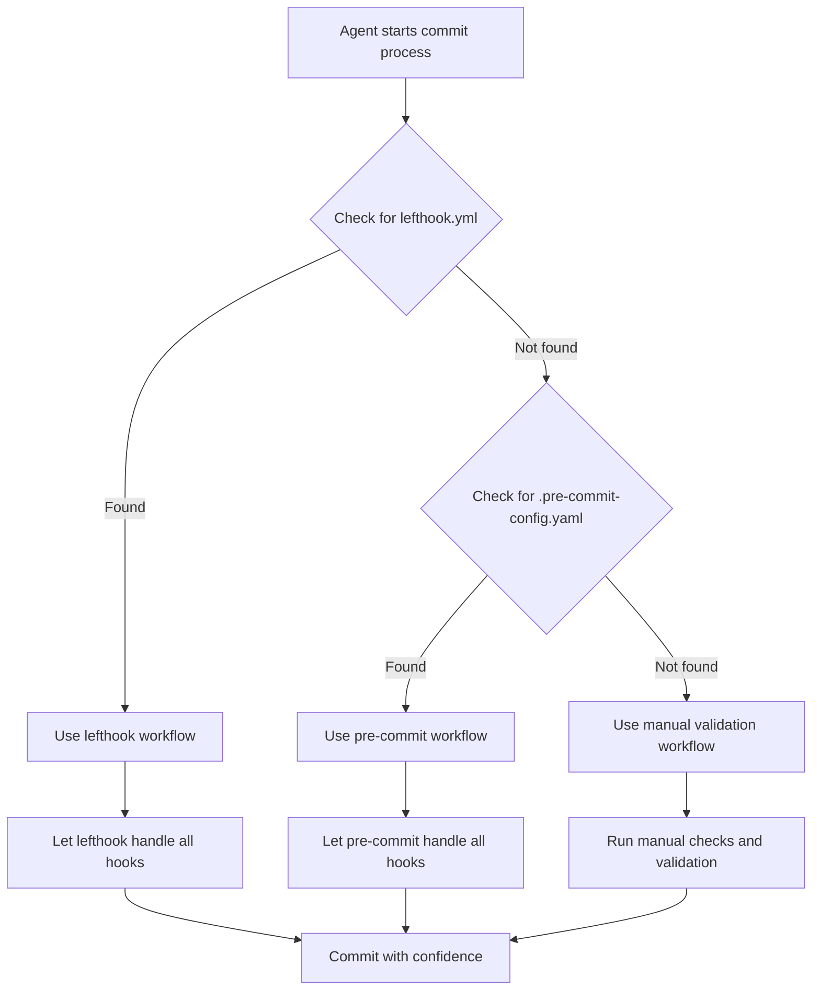

# /commit-lint — Commit linting configuration for AI agents

This document outlines the commit linting configuration and guidelines that AI agents must follow when committing files.

## Overview

The commit linting system ensures code quality and consistency by automatically running formatting, linting, and commit message validation checks before any commits are made by AI agents. This comprehensive system uses both lefthook pre-commit hooks and commitlint to prevent the introduction of poorly formatted code or improperly formatted commit messages into the repository.

## Installation

### Commitlint Setup

Install commitlint for commit message validation:

```bash
# Install commitlint CLI and conventional config
pnpm add -D @commitlint/cli @commitlint/config-conventional

# Install lefthook for pre-commit hooks
pnpm add -D lefthook

# Initialize lefthook hooks
pnpm run lefthook:install
```

### Required Dependencies

Ensure these packages are installed:
- `@commitlint/cli` - Commit message linting
- `@commitlint/config-conventional` - Conventional commit rules
- `lefthook` - Git hooks management
- `@biomejs/biome` - Code formatting and linting

## Configuration

### Ruler.toml Configuration

The commit linting configuration is defined in `ruler.toml` under the `[commit]` section:

```toml
[commit]
enabled = true
pre_commit_commands = [
  "pnpm run format",    # Format code with Biome
  "pnpm run lint",      # Run linting and checks
  "pnpm run check"      # Run all quality checks
]
```

### Commitlint Configuration

Commit message validation is configured in `.commitlintrc.json`:

```json
{
  "extends": ["@commitlint/config-conventional"],
  "rules": {
    "type-enum": [
      2,
      "always",
      [
        "feat",
        "fix",
        "docs",
        "style",
        "refactor",
        "test",
        "chore",
        "perf",
        "ci",
        "build",
        "revert"
      ]
    ],
    "type-case": [2, "always", "lower"],
    "type-empty": [2, "never"],
    "subject-empty": [2, "never"],
    "subject-full-stop": [2, "never", "."],
    "header-max-length": [2, "always", 72],
    "body-leading-blank": [1, "always"],
    "footer-leading-blank": [1, "always"]
  }
}
```

### Lefthook Configuration

Git hooks are managed through `lefthook.yml` with three main stages:

1. **Pre-commit**: Code formatting and linting
2. **Commit-msg**: Commit message validation
3. **Pre-push**: Comprehensive quality checks

## Pre-commit Commands

### 1. Code Formatting (`pnpm run format`)
- Uses Biome to format all code files
- Ensures consistent indentation, spacing, and line breaks
- Applies project-specific formatting rules

### 2. Linting (`pnpm run lint`)
- Runs comprehensive linting checks
- Validates code quality and style
- Checks for potential bugs and issues

### 3. Quality Checks (`pnpm run check`)
- Runs all automated quality verification
- Ensures ruler rules are applied
- Verifies no uncommitted changes remain

## File Patterns

The linting system targets specific file types to optimize performance:

- **JavaScript/TypeScript**: `*.{js,jsx,ts,tsx}`
- **Configuration Files**: `*.{json,css,md,yml,yaml,toml}`
- **Programming Languages**: `*.py`, `*.rs`, `*.go`, `*.java`
- **Infrastructure**: `Makefile*`, `Dockerfile*`

## Auto-fix Capabilities

The system includes auto-fix commands that attempt to resolve issues automatically:

- **Biome Format**: `pnpm run biome:format`
  - Automatically formats code
  - Fixes spacing and indentation issues

- **Biome Check**: `pnpm run biome:check --write`
  - Auto-fixes linting violations where possible
  - Applies safe corrections

## Agent Responsibilities

When contributing code, AI agents must ensure code quality by:

1. **Run Pre-commit Checks**: Execute all pre-commit commands before finalizing changes
2. **Review Auto-fixes**: Verify that auto-fixes have been applied correctly
3. **Manual Fixes**: Address any issues that cannot be auto-fixed
4. **Verify Quality**: Ensure all checks pass before contributing
5. **Test Changes**: Validate that formatting changes don't break functionality
6. **Solo Authorship**: DO NOT include co-authorship in commit messages - commits should be solo-authored
7. **PR Attribution**: Include AI attribution in PR descriptions, not commit messages

## Pre-commit Hook Detection

AI agents must automatically detect which pre-commit hook system is being used and adapt their behavior accordingly:

### Detection Logic

```bash
# Check for lefthook
if [ -f ".lefthook.yml" ] || [ -f "lefthook.yml" ]; then
  HOOK_SYSTEM="lefthook"
elif [ -f ".pre-commit-config.yaml" ]; then
  HOOK_SYSTEM="pre-commit"
else
  HOOK_SYSTEM="none"
fi
```

#### Fish Detection Logic

```fish
# Check for lefthook (Fish)
set HOOK_SYSTEM none
if test -f .lefthook.yml -o -f lefthook.yml
  set HOOK_SYSTEM lefthook
else if test -f .pre-commit-config.yaml
  set HOOK_SYSTEM pre-commit
end
```

### Lefthook Detection and Usage

**Files to check:**
- `lefthook.yml` (project root)
- `.lefthook.yml` (project root)

**When lefthook is detected:**
- Use lefthook commands for validation
- Respect lefthook configuration settings
- Allow lefthook to handle pre-commit, commit-msg, and pre-push hooks
- Do not run duplicate linting if lefthook is configured

**Lefthook workflow:**
```bash
# Let lefthook handle the hooks automatically
git add <files>
git commit -m "feat: add new feature"

# lefthook will automatically run:
# - pre-commit: formatting and linting
# - commit-msg: commitlint validation
# - pre-push: comprehensive checks
```

### Pre-commit Detection and Usage

**Files to check:**
- `.pre-commit-config.yaml` (project root)

**When pre-commit is detected:**
- Use pre-commit commands for validation
- Respect pre-commit configuration
- Allow pre-commit to manage all hooks
- Do not interfere with pre-commit's hook management

**Pre-commit workflow:**
```bash
# Let pre-commit handle the hooks automatically
git add <files>
git commit -m "feat: add new feature"

# pre-commit will automatically run configured hooks
```

### No Hook System Detected

**When neither system is detected:**
- Fall back to manual validation
- Run linting commands directly
- Validate commit messages manually
- Provide guidance for setting up hooks

**Manual workflow:**
```bash
# Run manual checks
pnpm run lint
pnpm run format
pnpm run check

# Validate commit message format
echo "feat: add new feature" | npx commitlint

# Then commit
git add <files>
git commit -m "feat: add new feature"
```

### Agent Decision Flow

The agent should follow this decision-making process:



### Conflict Resolution

**If both systems are detected:**
- Prioritize lefthook (more project-specific configuration)
- Warn about potential conflicts
- Suggest consolidating to one system

**Detection priority:**
1. lefthook (project-specific, more flexible)
2. pre-commit (standardized, widely adopted)
3. manual validation (fallback)

### Environment-Specific Behavior

**CI/CD Environment:**
- Always use manual validation
- Run all checks explicitly
- Don't rely on git hooks

**Local Development:**
- Use detected hook system
- Fall back to manual if hooks fail
- Provide helpful error messages

### Implementation Example

Here's how an AI agent can implement the detection logic:

```javascript
// Node.js/TypeScript implementation
function detectHookSystem(projectRoot = process.cwd()) {
  const fs = require('fs');
  const path = require('path');

  // Check for lefthook configuration
  const lefthookFiles = ['lefthook.yml', '.lefthook.yml'];
  for (const file of lefthookFiles) {
    if (fs.existsSync(path.join(projectRoot, file))) {
      return {
        system: 'lefthook',
        configFile: file,
        workflow: 'automatic'
      };
    }
  }

  // Check for pre-commit configuration
  const preCommitFile = '.pre-commit-config.yaml';
  if (fs.existsSync(path.join(projectRoot, preCommitFile))) {
    return {
      system: 'pre-commit',
      configFile: preCommitFile,
      workflow: 'automatic'
    };
  }

  // No hook system detected
  return {
    system: 'manual',
    configFile: null,
    workflow: 'manual'
  };
}

// Usage in agent
const hookConfig = detectHookSystem();

switch (hookConfig.system) {
  case 'lefthook':
    console.log(`✅ Lefthook detected (${hookConfig.configFile})`);
    console.log('Using lefthook workflow...');
    break;

  case 'pre-commit':
    console.log(`✅ Pre-commit detected (${hookConfig.configFile})`);
    console.log('Using pre-commit workflow...');
    break;

  default:
    console.log('⚠️  No hook system detected');
    console.log('Using manual validation workflow...');
    break;
}
```

```python
# Python implementation
import os
from pathlib import Path

def detect_hook_system(project_root: str = ".") -> dict:
    """Detect which pre-commit hook system is being used."""

    # Check for lefthook configuration
    lefthook_files = ['lefthook.yml', '.lefthook.yml']
    for file in lefthook_files:
        if os.path.exists(os.path.join(project_root, file)):
            return {
                'system': 'lefthook',
                'config_file': file,
                'workflow': 'automatic'
            }

    # Check for pre-commit configuration
    pre_commit_file = '.pre-commit-config.yaml'
    if os.path.exists(os.path.join(project_root, pre_commit_file)):
        return {
            'system': 'pre-commit',
            'config_file': pre_commit_file,
            'workflow': 'automatic'
        }

    # No hook system detected
    return {
        'system': 'manual',
        'config_file': None,
        'workflow': 'manual'
    }

# Usage
hook_config = detect_hook_system()

if hook_config['system'] == 'lefthook':
    print(f"✅ Lefthook detected ({hook_config['config_file']})")
    print("Using lefthook workflow...")
elif hook_config['system'] == 'pre-commit':
    print(f"✅ Pre-commit detected ({hook_config['config_file']})")
    print("Using pre-commit workflow...")
else:
    print("⚠️  No hook system detected")
    print("Using manual validation workflow...")
```

## Integration with Existing Tools

### Lefthook Integration
The commit linting system works alongside existing lefthook pre-commit hooks:

- **Pre-commit Hook**: Runs formatting on relevant files
- **Pre-push Hook**: Runs linting before pushing
- **Commit Lint**: Additional validation for AI agent commits

### Biome Configuration
The system leverages the existing Biome configuration:

```json
{
  "formatter": {
    "enabled": true,
    "formatWithErrors": true,
    "indentStyle": "space"
  },
  "linter": {
    "enabled": true,
    "rules": {
      "recommended": true
    }
  }
}
```

## Error Handling

### Common Issues
- **Formatting Failures**: Check Biome configuration and file permissions
- **Linting Errors**: Review error messages and fix manually if auto-fix fails
- **Command Not Found**: Ensure pnpm and Biome are properly installed

### Troubleshooting Steps
1. Verify Biome installation: `pnpm biome --version`
2. Check configuration: `pnpm run biome:check`
3. Run manual format: `pnpm run biome:format`
4. Review git status after fixes

## Quality Standards

### Code Formatting
- Use 2-space indentation (configured in Biome)
- Consistent line endings and encoding
- Proper spacing around operators and keywords

### Linting Rules
- Follow Biome recommended rules
- No unused variables or imports
- Consistent naming conventions
- Proper error handling

### Commit Message Standards
- Use conventional commit format: `feat:`, `fix:`, `refactor:`, `docs:`, `chore:`
- Keep messages under 72 characters
- Include descriptive details for complex changes

## Best Practices

### For AI Agents
- **Always run linting before contributing code**
- **Review auto-fixes for correctness**
- **Test functionality after formatting changes**
- **Use descriptive commit messages**
- **Solo-authored commits only** - DO NOT include co-authorship in commit messages
- **PR attribution only** - Include AI attribution in PR descriptions, not commits

### For Development Workflow
- **Regular updates**: Keep Biome and dependencies updated
- **Configuration review**: Regularly audit linting rules
- **Performance monitoring**: Ensure linting doesn't slow down workflow
- **Documentation updates**: Keep this document current with configuration changes

## Commit Message Standards

### Conventional Commit Format

All commit messages must follow the conventional commit format:

```bash
<type>[optional scope]: <description>

[optional body]

[optional footer]
```

### Commit Types

- `feat`: A new feature
- `fix`: A bug fix
- `docs`: Documentation only changes
- `style`: Changes that do not affect the meaning of the code
- `refactor`: A code change that neither fixes a bug nor adds a feature
- `test`: Adding missing tests or correcting existing tests
- `chore`: Changes to the build process or auxiliary tools
- `perf`: A code change that improves performance
- `ci`: Changes to CI configuration files and scripts
- `build`: Changes that affect the build system or external dependencies
- `revert`: Reverts a previous commit

### Examples

```bash
# Feature commit
feat: add user authentication system

# Bug fix with scope
fix(auth): resolve login validation error

# Documentation update
docs: update API documentation for v2.0

# Refactoring with body
refactor: simplify user model validation logic

- Remove redundant validation checks
- Consolidate error handling
- Improve code readability

# Breaking change
feat!: change authentication API interface

BREAKING CHANGE: The authenticate() method now requires email parameter
```


This commit linting system ensures that all AI agent contributions maintain the same high standards of code quality, formatting, and commit message conventions as human developers, creating a consistent and maintainable codebase.
